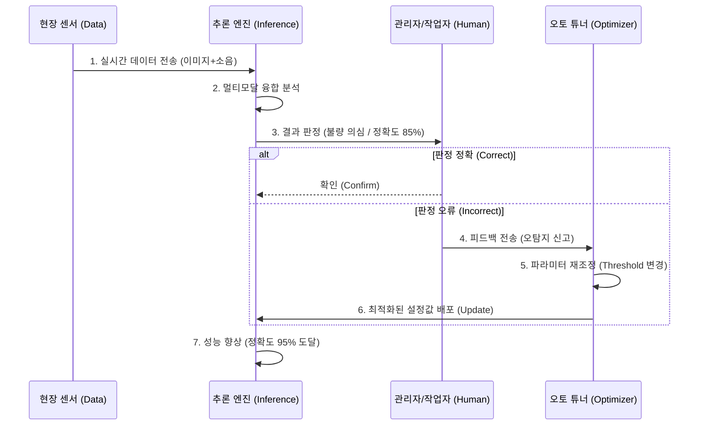
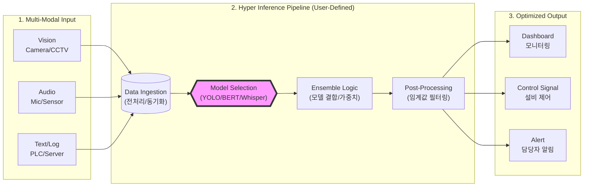

# proposal_01

Type A. [개념도] 사용자 정의형 파이프라인 (High-Level Concept)
목적: "레고 블록처럼 조립한다"는 핵심 컨셉을 직관적으로 보여주기 위함 (제안서 앞부분용) 핵심 키워드: Input → Block Assembly → Output

Type B. [상세 구조도] 시스템 아키텍처 (System Architecture)
목적: 기술적 깊이와 구성 요소(MSA, Docker 등)를 보여주기 위함 (기술 부문용) 구조: 4-Tier Layer (인프라 - 코어 - 서비스 - 유저)

Type C. [프로세스] 자율 최적화 데이터 흐름도 (Process Flow)
목적: "어떻게 스스로 똑똑해지는가?"(Auto-Tuning)를 설명하기 위함 핵심: Feedback Loop (순환 구조)

